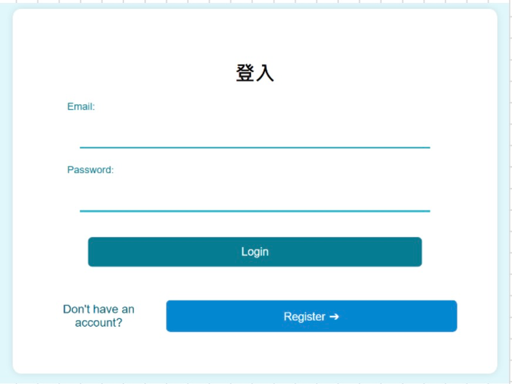
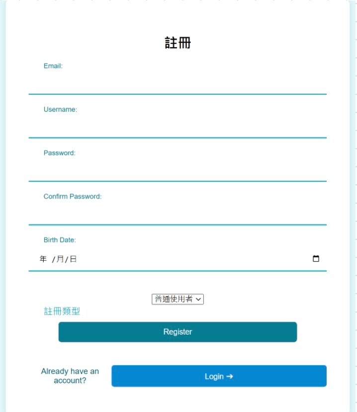
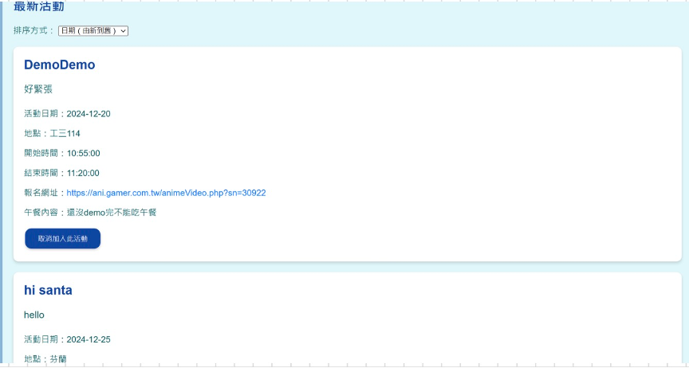
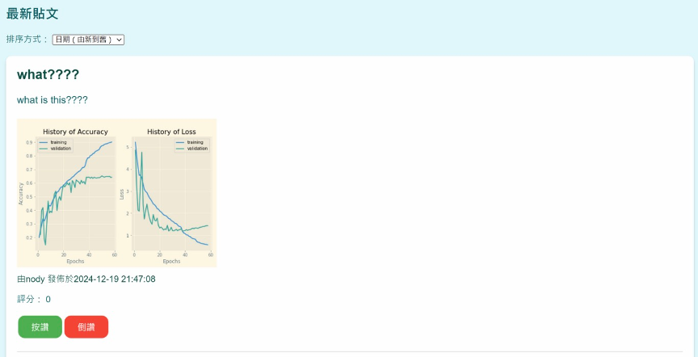
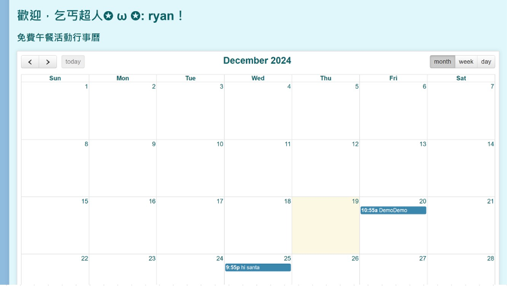
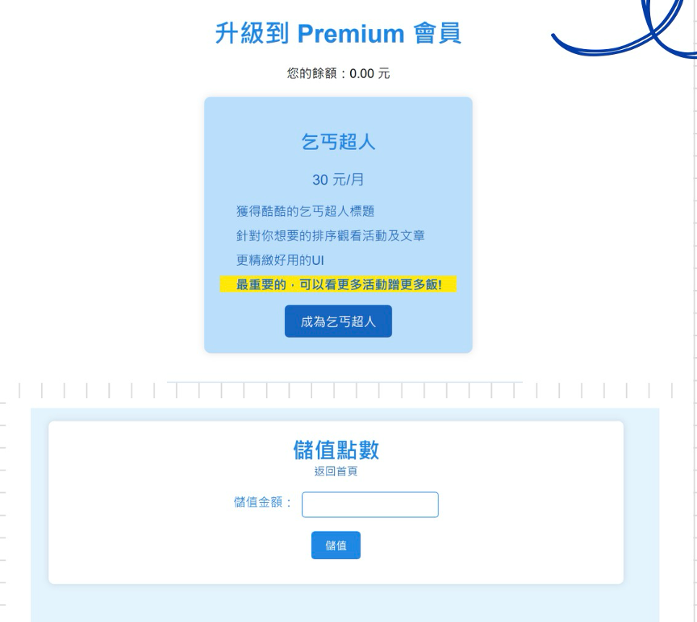
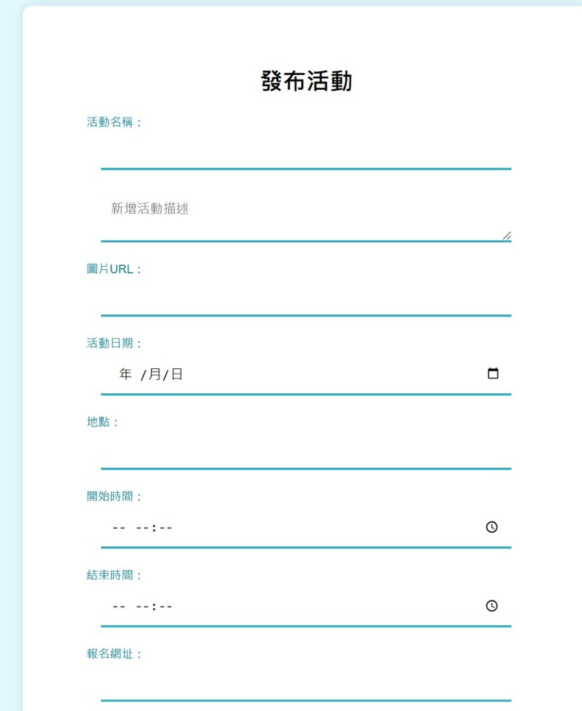
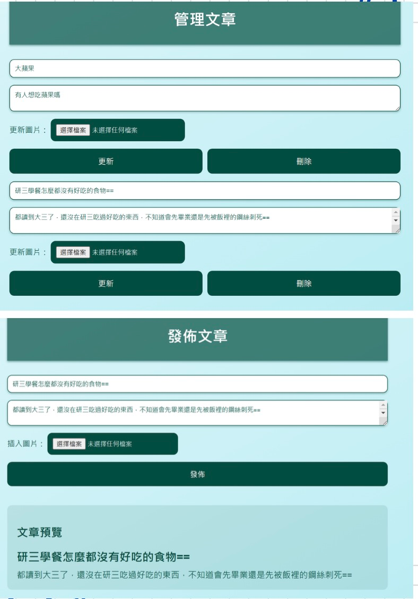

# 乞丐超人 - 免費食物交流平台

## 開發者

* 黃浚瑀
* 顏慎皓
* 程品諭
* 張肇政
* 邱苓禎

## 簡介

「乞丐超人」是一個免費的食物交流平台，旨在讓學校的管理員能透過此平台發布活動、使用者除了能得到活動資訊，還能夠分享和獲取免費食物的心得貼文。這個平台提供了活動發布、瀏覽、討論等多項功能，方便使用者參與各種食物交流或講座宣傳活動。

## 動機  

身為對金錢敏感的大學生，透過聽補習班講座、學校講座省下午餐錢可以說是必備技能吧！我們想建立一個資訊共享平台，讓窮學生隨時能得知免費午餐的資訊，完善互助精神，當一個堂堂正正的乞丐超人。

## 功能

### 使用者功能

* **登入與註冊：**

    
    

* **瀏覽活動資訊：** 使用者可以查看即將到來的免費食物活動。

    

* **參與討論：** 使用者可以發布討論文章、上傳圖片，並對其他使用者的文章進行評論、按讚或倒讚。 

    

* **個人化行事曆：** 使用者可以將感興趣的活動新增到個人行事曆中，方便追蹤。

    

* **升級Premium會員：** 使用者可以儲值點數，並升級為Premium會員，以享有更多特權。

    

### Premium會員特權

* **專屬稱號：** Premium會員將獲得「乞丐超人」的尊爵稱號。
* **無限制瀏覽：** Premium會員可以無限制地瀏覽活動和貼文。
* **多樣排序功能：** Premium會員可以根據評分等條件，對貼文和活動進行排序。
* **快速導航：** Premium會員可以使用一鍵至主頁頂端、底端的功能，提升使用效率。 

### 管理者功能

* **發布活動資訊：** 管理者可以在平台上發布免費食物活動的相關資訊。 
* **管理活動內容：** 管理者可以更新和管理平台上發布的活動內容。 
* **活動總覽：** 管理者可以查看平台上所有活動的總覽。 
* **新增活動：** 管理者可以新增新的活動到平台上。 
* **更新活動：** 管理者可以更新現有活動的資訊。 

    
    

## 未來展望

* **實際儲值機制：** 開發真正的儲值機制和點數運用系統。 
* **Email通知：** 增加使用email通知使用者活動時間的功能。 
* **更多Premium功能：** 持續開發更多Premium會員的專屬功能，提升會員價值。 
